<a href="https://spring.io/"> </a>
<a href="https://www.mysql.com/"> </a>
<a href="https://redis.io/"> </a>
<a href="https://firebase.google.com/docs?hl=vi"> </a>
<a href="https://legacy.reactjs.org/docs/getting-started.html"> </a>
<a href="https://nginx.org/en/docs/"> </a>
<a href="https://www.docker.com/"> </a>

# Apartment Management

An efficient apartment management website providing streamlined tools for residents and administrators to
manage facilities, schedules, and community communications effectively.


## Table of contents
* ✨[Features](#features)
* 🏛️[Architecture diagram](#architecture-diagram)
* 📅[Database schema diagram](#database-schema-diagram)
* 🛠️[Prerequisites](#prerequisites)
* 🚀[Getting Started](#getting-started)
* 📊[Admin Interface](#admin-interface)
* 🏠[User Interface](#user-interface)
* 🔧[Configure Environment Variables](#configure-environment-variables)
* 🔗[References](#references)
* 📧[Contact](#contact)

## ✨Features
#### 1. Account Management
- **Admin Account Provisioning**: Administrators issue accounts to residents. After receiving an account, residents must change their password and upload an avatar to use the system.
- **Role-Based Login**: Users can log in with roles as either administrators or residents.
#### 2. Payment Processing
- **Monthly Fee Payments**: Residents can pay monthly management fees, parking fees, and other service charges via bank transfer to a fixed MoMo account, and upload the transaction screenshot. Alternatively, they can make direct online payments through MoMo Pay, VNPay, or another payment gateway.
- **Invoice Lookup**: Residents can look up all types of invoices they have paid.
#### 3. Parking Management
- **Family Member Registration**: Residents can register family members to receive parking cards and gate access.
#### 4. Account Suspension
- **Account Locking**: Administrators lock resident accounts when the resident transfers ownership of their apartment. Administrators then issue new accounts to the new residents.
#### 5. Package Management
- **Electronic Locker**: Each resident has an electronic locker in the system. When a resident receives a delivery, the management team can receive it on their behalf if they are not home. The system will display a list of pending items in the resident’s locker (integrating push notifications or SMS). Once the resident collects their package, the management team updates the status to received.
#### 6. Feedback System
- **Resident Feedback**: Residents can submit feedback regarding inappropriate activities or behaviors within the apartment complex.
#### 7. Survey Management
- **Survey Creation**: The management team can create surveys for residents regarding cleanliness, facilities, and services.
- **Survey Participation and Results**: Residents complete surveys, and the system compiles and presents the results to the management team.

## 🏛️Architecture diagram
Overall Application Architecture


Backend Architecture


## 📅Database schema diagram


## 🛠️Prerequisites
What you need to run the project:
- [Docker](https://www.docker.com/) - Streamline your local setup by using Docker to containerize and run the project without needing additional dependencies.
- [Maven](https://maven.apache.org/download.cgi) - Utilize Maven to efficiently build the .war file for the backend server.

## 🚀Getting Started
After installing Docker, run the following commands to start experiencing this project:
```shell
# download the project
git clone https://github.com/Theanhmgt/apartment-management/
# build file .war
cd backend
mvn install
# build container
cd ..
docker compose build
# run container
docker compose up
```
At this time, you can now access the administration portal by navigating to http://localhost:8081/ApartmentManagement/. Alternatively, residents can log in to the resident site at http://localhost:3000/.

## 📊Admin Interface
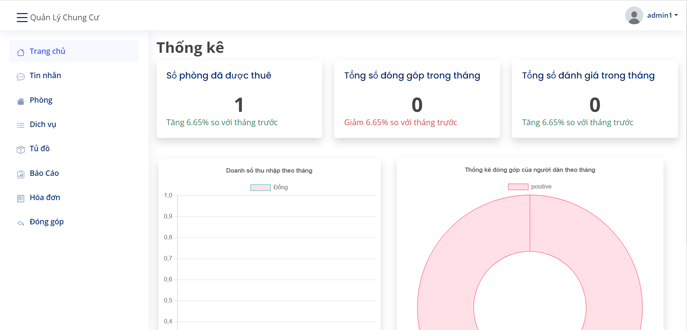</img>
</img>
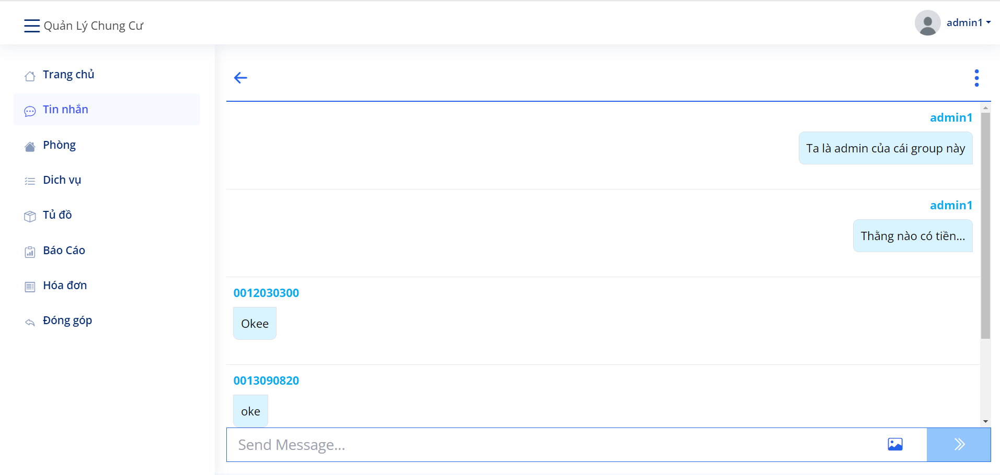</img>
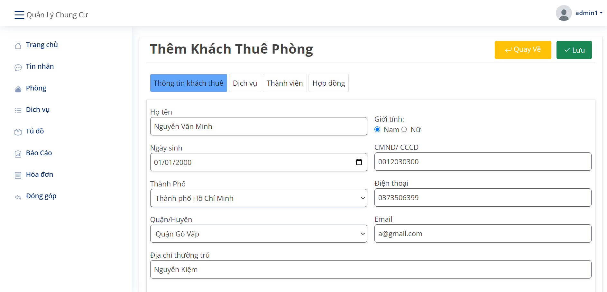</img>
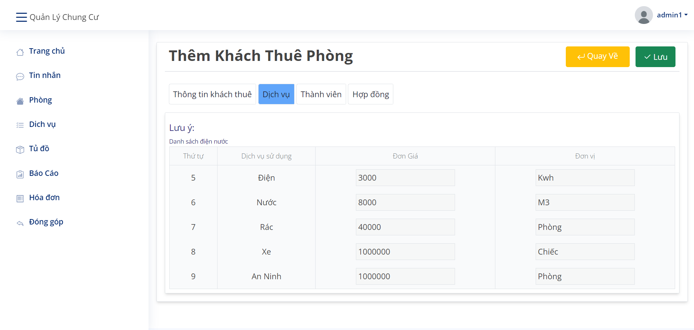</img>
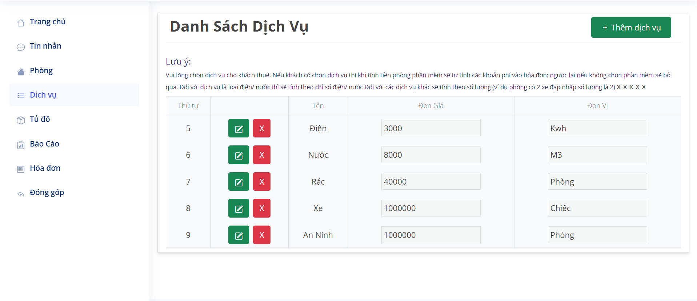</img>

## 🏠User Interface
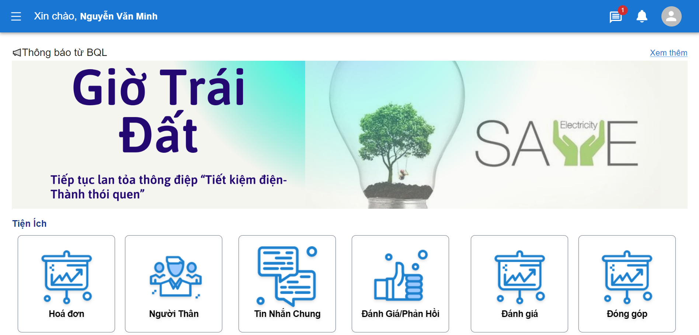</img>
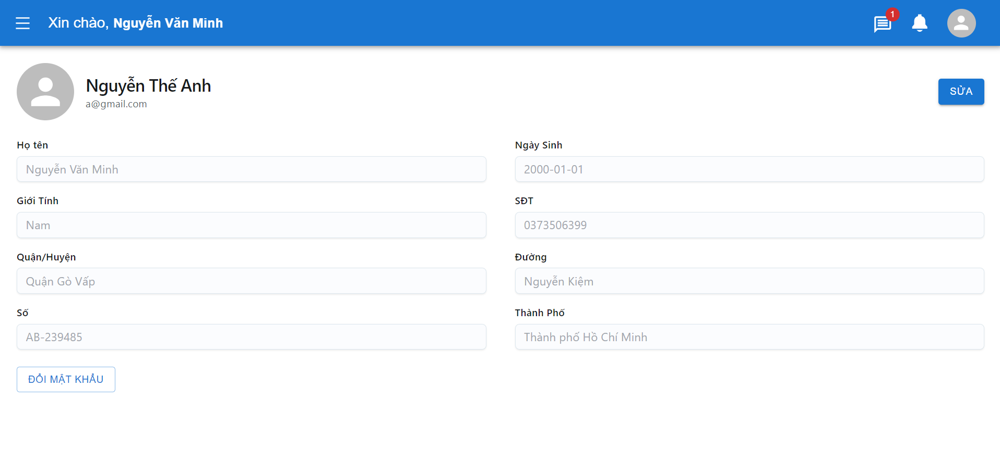</img>
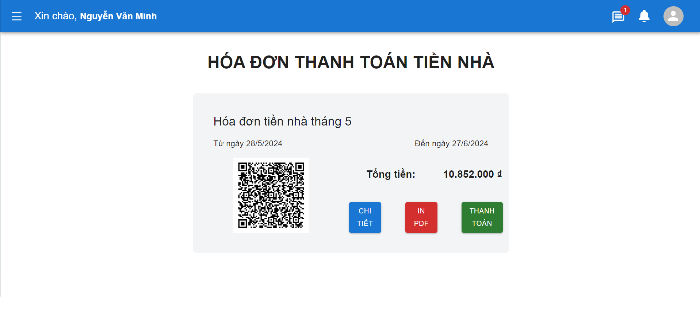</img>
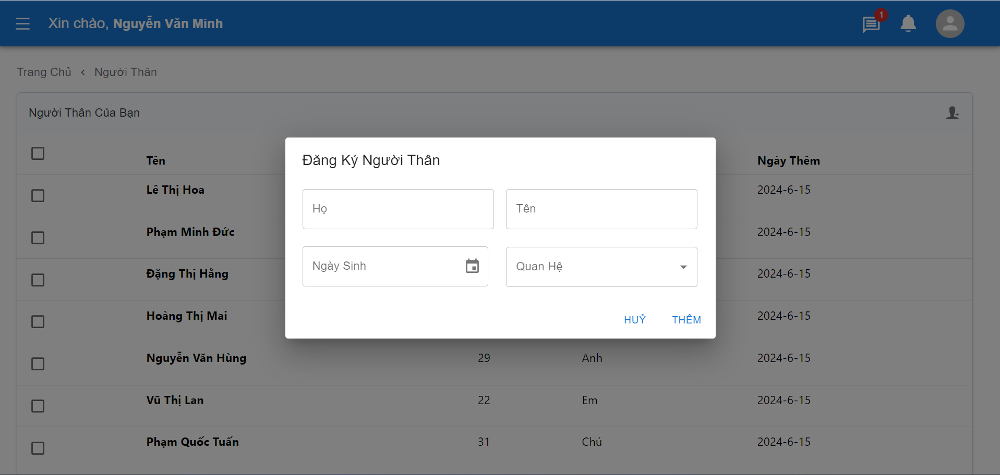</img>
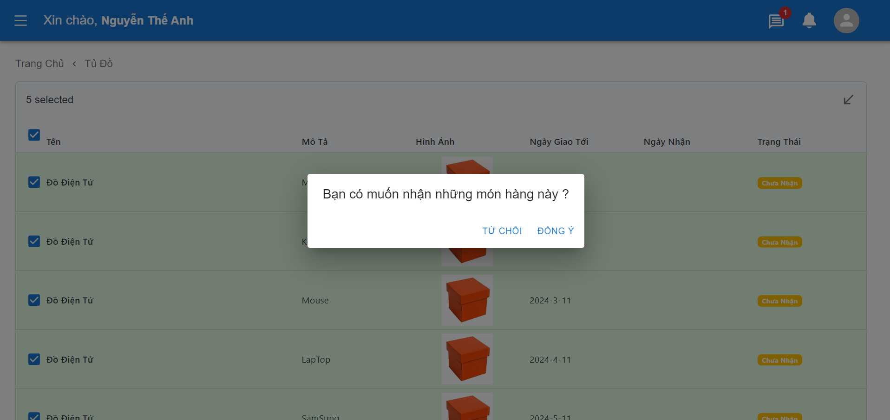</img>
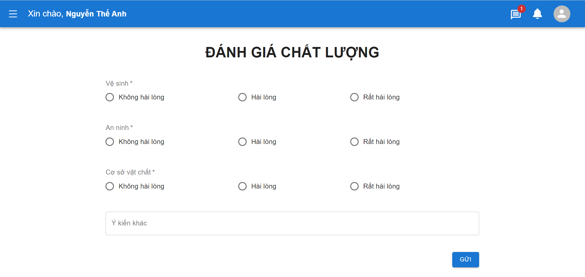</img>


## 🔧Configure Environment Variables

To utilize all features of this project, including real-time chat, ensure you configure necessary environment variables in the `.env` file for the frontend and `application-dev.properties` file for the backend. Detailed instructions are provided below.

### Frontend

1. Navigate to the `frontend` directory.
2. Create a `.env` file if it doesn't already exist.
3. Configure Firebase API keys as follows. These values are retrieved from your Firebase project:

    ```dotenv
    REACT_APP_FIREBASE_API_KEY=your-firebase-api-key
    REACT_APP_FIREBASE_AUTH_DOMAIN=your-project.firebaseapp.com
    REACT_APP_FIREBASE_PROJECT_ID=your-project-id
    REACT_APP_FIREBASE_STORAGE_BUCKET=your-storage-bucket.appspot.com
    REACT_APP_FIREBASE_MESSAGING_SENDER_ID=your-messaging-sender-id
    REACT_APP_FIREBASE_APP_ID=your-app-id
    ```

### Backend

1. Navigate to the `backend/src/main/resources` directory.
2. Open the `application-dev.properties` file.
3. Configure Firebase API keys as follows. These values are retrieved from your Firebase project:

    ```properties
    firebase.apiKey=your-firebase-api-key
    firebase.authDomain=your-project.firebaseapp.com
    firebase.projectId=your-project-id
    firebase.storageBucket=your-storage-bucket.appspot.com
    firebase.messagingSenderId=your-messaging-sender-id
    firebase.appId=your-app-id
    ```

4. Create a `firebase-service-account.json` file and add the Firebase service account credentials. These credentials are typically downloaded from your Firebase project settings and should look like this:

    ```json
    {
      "type": "",
      "project_id": "",
      "private_key_id": "",
      "private_key": "",
      "client_email": "",
      "client_id": "",
      "auth_uri": "",
      "token_uri": "",
      "auth_provider_x509_cert_url": "",
      "client_x509_cert_url": "",
      "universe_domain": ""
    }
    ```

Replace `your-firebase-api-key`, `your-project.firebaseapp.com`, `your-project-id`, `your-storage-bucket.appspot.com`, `your-messaging-sender-id`, and `your-app-id` with the actual Firebase configuration values specific to your project. These steps ensure this project can securely connect and interact with Firebase services.

## 🔗References
Here are some helpful resources and references for further information:
- [Spring Documentation](https://spring.io/)
- [React Documentation](https://legacy.reactjs.org/docs/getting-started.html)
- [Docker Documentation](https://docs.docker.com/)

## 📧Contact
Don't hesitate to contact me if you have any confusion or questions
<a href="https://anhthenguyen.work@gmail.com" target="blank">
  
</a>
<a href="http://www.linkedin.com/in/anhthenguyen204/" target="blank">
  
</a>

<a href="#apartment-management" style="transition: all .25s ease-in-out; position: fixed; bottom: 0; right: 0; display: inline-flex; cursor: pointer; align-items: center; justify-content: center; margin: 0 2em 2em 0; padding: .25em; width: 8em; height: 2em;">
  🔼 Back to top
</a>
